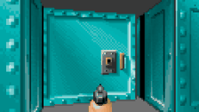
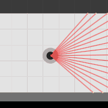

Play offline on a github demo page:
[pd-22.github.io/wolf3d](https://pd-22.github.io/wolf3d/)

Play online multiplayer on Render:
[wolf3d.onrender.com](https://wolf3d.onrender.com/)

Shortcuts | Description
-|-
<kbd>w a s d</kbd> | Move
<kbd>Move Mouse</kbd> <kbd>q e</kbd> | Look around
<kbd>Left click</kbd> <kbd>Space</kbd> | Use the equipped tool
<kbd>1 2</kbd>        | Switch equipped tool
<kbd>f</kbd>        | Open door
<kbd>F11</kbd>      | Toggle Fullscreen
<kbd>-</kbd>        | Volume down
<kbd>+</kbd>        | Volume up
<kbd>`</kbd>        | Toggle devMode
<kbd>g</kbd>        | Toggle devMode map
<kbd>h</kbd>        | Toggle devMode stats
